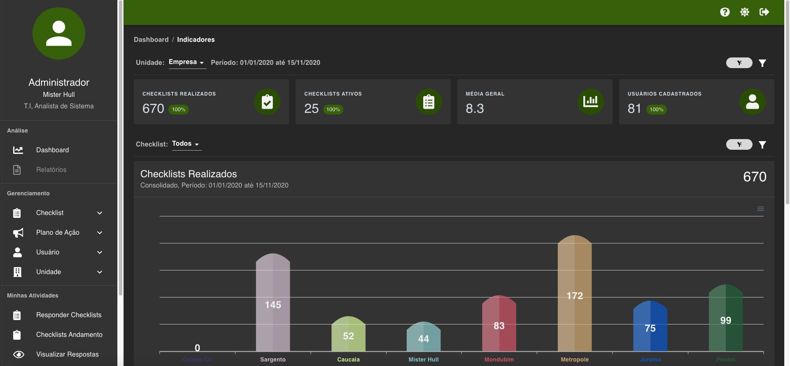
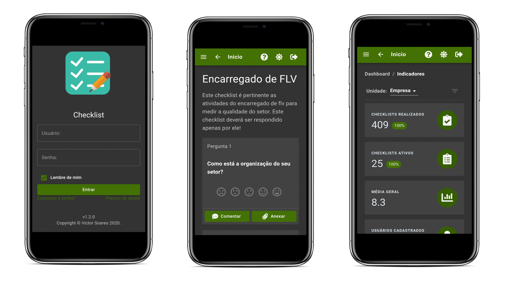

   

  
  
  
  <!---->

  <h1>Checklist</h1>

  Controle e Auditoria de Operações. Made by ( ) => 
    <a href="https://portfolio.com/victorsoares96">Victor Soares</a>
  

# Sobre

Checklist é um sistema desenvolvido para o controle e auditoria de operações que visa a otimização de tempo na coleta de dados e que oferece relatórios gerenciais, fundamentais para a tomada de decisão e solução das não-conformidades. Com ele, você evita falhas e esquecimentos. Seu uso também permite acompanhar detalhadamente tudo o que já está completo ou o que ainda falta ser feito. Um checklist de auditoria bem-feito ajuda a direcionar a empresa a uma cultura de melhoria contínua.

# Index

* [Web Demo](#demo-website)   
* [Componentes](#made-with)
* [Recursos](#features)
* [Screenshots](#screenshots)

# Screenshots

## Web Screenshot

  

## Mobile Screenshot

  

# Demo Website

[Veja a versão de demonstração](https://checklistwebvictor.netlify.app/)

### Usuário: admin
### Senha: admin123

#### Repositório com o código fonte está privado

# Recursos
Colocar recursos

## Core
* [React](https://reactjs.org/)
* [Express](https://expressjs.com/)

## Serviços
* [AWS](https://aws.amazon.com/)
* [MongoAtlas](https://www.mongodb.com/cloud/atlas)
* [Heroku](https://heroku.com/)
* [Netlify](https://www.netlify.com/)
  
## UI
* [Material UI](https://material-ui.com/)
* [React Icons](https://react-icons.github.io/)
* [notistack](https://iamhosseindhv.com/notistack/)
  
## Formulários & Validação
* [Formik](https://formik.org/)
* [Yup](https://github.com/jquense/yup)
* [Unform](https://unform.dev/)
* [Date-fns](https://date-fns.org/)
  
## Cliente HTTP
* [Axios](https://github.com/axios/axios)
  
## Sistema de Rotas
* [React Router Dom](https://reactrouter.com/)

## Gráficos
* [Apex Charts](https://apexcharts.com/)
  
## Outros
* [lodash](https://lodash.com/)
* [jwt]()
* [react-lottie](https://github.com/chenqingspring/react-lottie)
* [bcryptjs](https://github.com/dcodeIO/bcrypt.js)
* [mongoose](https://mongoosejs.com/)
* [morgan](https://github.com/expressjs/morgan)
* [multer](https://github.com/expressjs/multer)
* [nodemailer](https://nodemailer.com/about/)
* [pdfkit](https://pdfkit.org/)
  
# Recursos

* Features here
